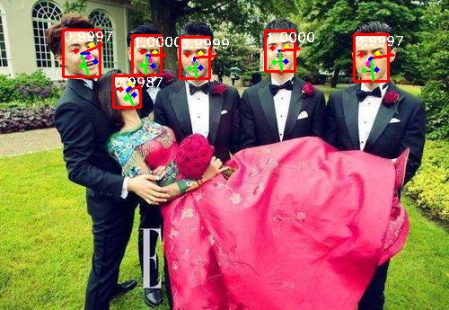

# RetinaFace in PyTorch

```
    author is leilei
```

### Note
+ This repository is forked from [biubug6/Pytorch_Retinaface](https://github.com/biubug6/Pytorch_Retinaface)
+ Based on this project, we merge the three tasks of face detection, face key point detection, and face pose estimation into one task.

### Inference
```
    python detect_merge.py ${-m} ${--network} ${--image_path} ${--output_path} 
```

### Demo
||
|----|

### Weight
+ [GoogleDriver](https://drive.google.com/file/d/1YbMLrUdgmY1vNTQ8Y6OhR0pKifZeCGWa/view?usp=sharing)

### Train
+ TODO release code

### References
+ [biubug6/Pytorch_Retinaface](https://github.com/biubug6/Pytorch_Retinaface)
+ [HopeNet-pytorch](https://github.com/natanielruiz/deep-head-pose)
+ [insightface-RetinaFaceAntiCov](https://github.com/deepinsight/insightface/tree/master/detection/RetinaFaceAntiCov)